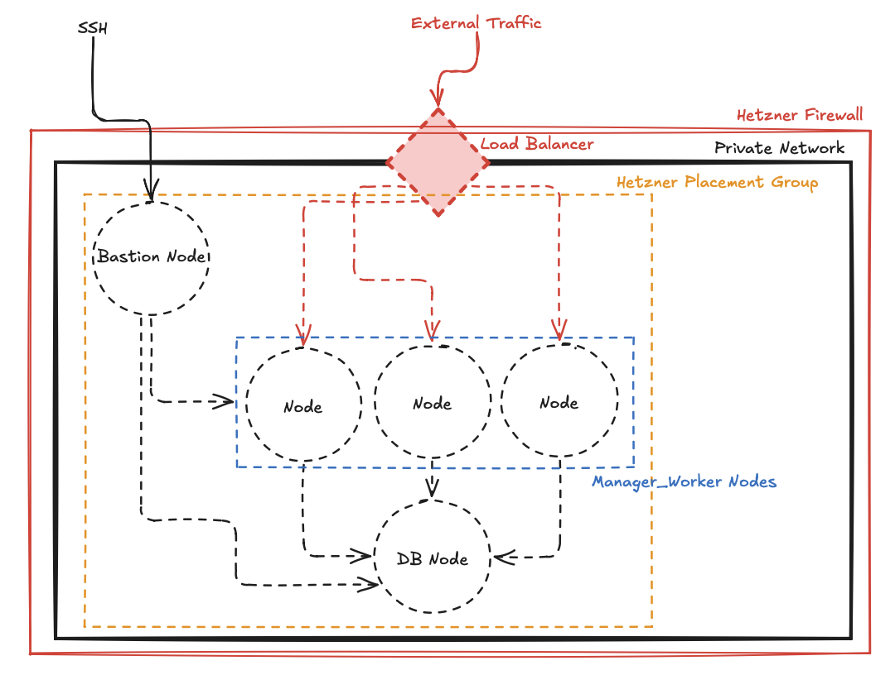

# Hetzner Cloud Simple Infrastructure Setup

Via Terraform/OpenTufu. Triple node setup featuring a bastion node and database node, ingress via loadbalancer and
machine provisioning by bastion. Some additional configuration required such as injecting automation/provisioning tools,
private keys on bastion, additional DNS setup for serving traffic over loadbalancer and volume attachments (if needed)
or Terraform/OpenTofu backends.

<!-- BEGIN_TF_DOCS -->

## Requirements

| Name                                                                      | Version    |
|---------------------------------------------------------------------------|------------|
|  [terraform](#requirement\_terraform) | \>= 1.11.5 |
|  [hcloud](#requirement\_hcloud)          | 1.60.1     |

## Providers

| Name                                                       | Version |
|------------------------------------------------------------|---------|
|  [hcloud](#provider\_hcloud) | 1.60.1  |

## Modules

| Name                                                                     | Source                 | Version |
|--------------------------------------------------------------------------|------------------------|---------|
|  [certificate](#module\_certificate)    | ./modules/certificate  | n/a     |
|  [firewall](#module\_firewall)             | ./modules/firewall     | n/a     |
|  [loadbalancer](#module\_loadbalancer) | ./modules/loadbalancer | n/a     |
|  [network](#module\_network)                | ./modules/network      | n/a     |
|  [node](#module\_node)                         | ./modules/node         | n/a     |
|  [ssh](#module\_ssh)                            | ./modules/ssh          | n/a     |
|  [zone](#module\_zone)                         | ./modules/zone         | n/a     |

## Resources

| Name                                                                                                                                    | Type     |
|-----------------------------------------------------------------------------------------------------------------------------------------|----------|
| [hcloud_zone](https://registry.terraform.io/providers/hetznercloud/hcloud/latest/docs/resources/zone)                                   | resource |
| [hcloud_managed_certificate](https://registry.terraform.io/providers/hetznercloud/hcloud/latest/docs/resources/managed_certificate)     | resource |
| [hcloud_network](https://registry.terraform.io/providers/hetznercloud/hcloud/latest/docs/resources/network)                             | resource |
| [hcloud_network_subnet](https://registry.terraform.io/providers/hetznercloud/hcloud/latest/docs/resources/network_subnet)               | resource |
| [hcloud_load_balancer](https://registry.terraform.io/providers/hetznercloud/hcloud/latest/docs/resources/load_balancer)                 | resource |
| [hcloud_load_balancer_network](https://registry.terraform.io/providers/hetznercloud/hcloud/latest/docs/resources/load_balancer_network) | resource |
| [hcloud_load_balancer_target](https://registry.terraform.io/providers/hetznercloud/hcloud/latest/docs/resources/load_balancer_target)   | resource |
| [hcloud_load_balancer_service](https://registry.terraform.io/providers/hetznercloud/hcloud/latest/docs/resources/load_balancer_service) | resource |
| [hcloud_firewall](https://registry.terraform.io/providers/hetznercloud/hcloud/latest/docs/resources/firewall)                           | resource |
| [hcloud_ssh_key](https://registry.terraform.io/providers/hetznercloud/hcloud/latest/docs/resources/ssh_key)                             | resource |
| [hcloud_placement_group](https://registry.terraform.io/providers/hetznercloud/hcloud/latest/docs/resources/placement_group)             | resource |
| [hcloud_server](https://registry.terraform.io/providers/hetznercloud/hcloud/latest/docs/resources/server)                               | resource |

## Inputs

| Name                                                                                                                | Description                                           | Type     | Default       | Required |
|---------------------------------------------------------------------------------------------------------------------|-------------------------------------------------------|----------|---------------|:--------:|
|  [hcloud\_token](#input\_hcloud\_token)                                            | Hetzner Cloud API token used to create infrastructure | `string` | n/a           |   yes    |
|  [managed\_domain](#input\_managed\_domain)                                       | FQDN to be associated with the project                | `string` | n/a           |   yes    |
|  [location](#input\_location)                                                          | Location to locate infrastructure                     | `string` | `fsn1`        |    no    |
|  [network\_ip\_range](#input\_network\_ip\_range)                              | IP range to limit the internal network to             | `string` | `10.0.0.0/16` |    no    |
|  [network\_subnet\_zone](#input\_network\_subnet\_zone)                     | Zone assignement for the network subnet               | `string` | `eu-central`  |    no    |
|  [network\_subnet\_ip\_range](#input\_network\_subnet\_ip\_range)       | IP range  to limit the internal network subnet to     | `string` | `10.0.1.0/24` |    no    |
|  [admin\_public\_ssh\_key](#input\_admin\_public\_ssh\_key)                | Admin user public ssh key                             | `string` | n/a           |   yes    |
|  [automation\_public\_ssh\_key](#input\_automation\_public\_ssh\_key) | Automation user public ssh key                        | `string` | n/a           |   yes    |
|  [lb\_type](#input\_lb\_type)                                                           | Node type of the loadbalancer                         | `string` | `lb11`        |    no    |
|  [machine\_image](#input\_machine\_image)                                         | Image to install on server nodes                      | `string` | `rocky-10`    |    no    |
|  [bastion\_type](#input\_bastion\_type)                                             | Node type of the bastion                              | `string` | `cx23`        |    no    |
|  [manager\_worker\_count](#input\_manager\_worker\_count)                  | Number of manager worker instances to create          | `number` | 3             |    no    |
|  [manager\_worker\_type](#input\_manager\_worker\_type)                     | Node type of the manager workers                      | `string` | `cx23`        |    no    |
|  [db\_type](#input\_db\_type)                                                           | Node type of the db                                   | `string` | `cx23`        |    no    |

## Outputs

| Name                                                                                                                                                  | Description                                      |
|-------------------------------------------------------------------------------------------------------------------------------------------------------|--------------------------------------------------|
|  [bastion\_ipv4\_address](#output\_bastion\_ipv4\_address)                                                  | IPv4 address of the bastion node                 |
|  [bastion\_private\_ip\_address](#output\_bastion\_private\_ip\_address)                              | Private IP address of the bastion node           |
|  [manager\_worker\_ipv4\_addresses](#output\_manager\_worker\_ipv4\_addresses)                     | IPv4 addresses of the manager worker nodes       |
|  [manager\_worker\_private\_ip\_addresses](#output\_manager\_worker\_private\_ip\_addresses) | Private IP addresses of the manager worker nodes |
|  [db\_private\_ip\_address](#output\_db\_private\_ip\_address)                                             | Private IP address of the db node                |

<!-- END_TF_DOCS -->
